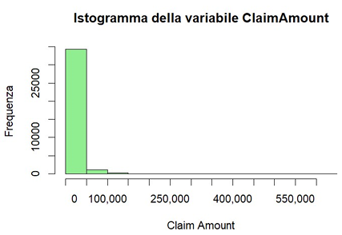
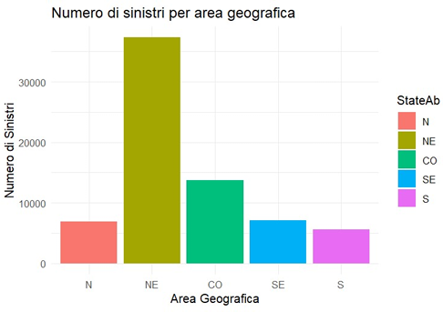
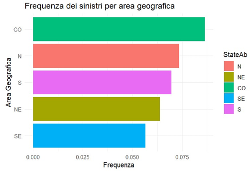
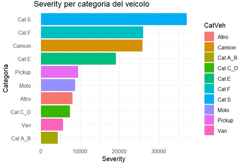
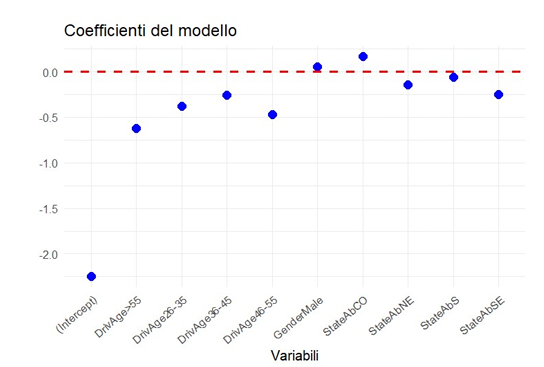
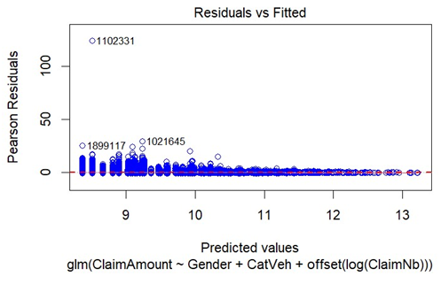
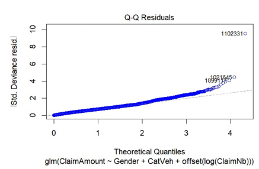

# GLM for Brazilian Motor Insurance
## Table of Contents
- [Project Objective](#project-objective)
- [Dataset](#dataset)
- [VehGroup Categorization](#vehgroup-categorization)
- [Descriptive Analysis](#analisi-descrittive)
- [Regression Results](#regression-results)
- [Rating Cells](#rating-cells)
- [GLM Models](#glm)
- [Residual Analysis](#residual-analysis)
- [Pricing and Financial Balance](#pricing-and-financial-balance)

## Project Objective
The objective of this project is to understand the factors that influenced the claims performance of the insurance portfolio, particularly regarding claim frequency and severity, and the consequent determination of insurance premiums using common pricing techniques.

## Dataset
The dataset **brevhins-B** contains the variables of an automobile insurance portfolio from Brazil, based on **AUTOSEG** (Statistical System for Automobiles) for the year 2011.

The key variables in the dataset are:

- **Gender** – Factor for gender (also includes corporate entities).
- **DrivAge** – Factor for the driver's age group.
- **VehYear** – Numeric value for the vehicle's manufacturing year.
- **VehModel** – Factor representing the vehicle model.
- **VehGroup** – Factor for vehicle group classification.
- **Area** – Factor containing the local area.
- **State** – Factor representing the states (StateAb contains abbreviations for the states).
- **ExposTotal** – Total exposure for the period.
- **SumInsAvg** – Average insured sum.
- **ClaimNb** – Number of claims during the exposure period.
- **ClaimAmount** – Total amount of claim payments during the exposure period.

#
##### Summary of ExposTotal (ds)

| Min.  | 1st Qu. | Median | Mean  | 3rd Qu. | Max.    |
|-------|--------|--------|-------|--------|--------|
| 0.000 | 0.400  | 0.530  | 3.153 | 1.780  | 1631.210 |

Examining the **ExposTotal** variable, values equal to zero were found. Since they are not useful for analysis, only values greater than zero were considered.
#
##### Summary of Gender

| Corporate | Female | Male | NA’s |
|-----------|--------|------|------|
| 75,331   | 127,876 | 168,935 | 10,512 |

The **corporate** gender category was excluded from the analysis as it contained missing values for the driver variable. Only **male** and **female** categories were considered.
#
##### Summary of ExposTotal after Modifications (df)

| Min.  | 1st Qu. | Median | Mean  | 3rd Qu. | Max.    |
|-------|--------|--------|-------|--------|--------|
| 0.0027 | 0.4600  | 0.7100  | 3.6723 | 2.1400  | 1631.210 |
#
##### Summary of Gender after Modifications (df)

| Corporate | Female | Male | 
|-----------|--------|------|
| 0 | 127,876 | 168,935 | 

Subsequently, the **StateAb** variable was discretized into five geographic areas:

- **North (N)**: Acre, Amapá, Amazonas, Pará, Rondônia, Roraima, Tocantins;
- **Northeast (NE)**: Alagoas, Bahia, Ceará, Maranhão, Paraíba, Pernambuco, Piauí, Rio Grande do Norte, Sergipe;
- **Central-West (CO)**: Federal District, Goiás, Mato Grosso do Sul, Mato Grosso;
- **Southeast (SE)**: Espírito Santo, Minas Gerais, Rio de Janeiro, São Paulo;
- **South (S)**: Paraná, Rio Grande do Sul, Santa Catarina.

NA values were not considered.
##### Summary of StateAb (df)

| N     | NE     | CO     | SE     | S     |
|-------|--------|--------|--------|--------|
| 38,353 | 130,330 | 55,912 | 37,808 | 34,406 |

# VehGroup Categorization

The variable `VehGroup` has been categorized into segments. Observations containing NA values were removed as they could negatively affect the model's precision.

## Minicars and Small Utility Vehicles (Categories A and B)
Vw Volkswagen Gol, Fiat Palio, Fiat Palio Weekend, Fiat Palio, Chevrolet Corsa, Fiat Uno, Peugeot 206, Peugeot 207, Renault Clio, Chevrolet Celta, Ford Fiesta, Honda Fit, Volkswagen Polo, Volkswagen Parati, Citroen C3, Fiat Siena, Volkswagen Fox, Ford Ka, Renault Sandero, Volkswagen Voyage, Volkswagen Fox, Volkswagen Spacefox, Volkswagen Crossfox, Fiat Idea, Fiat Punto, Chevrolet Prisma, Fiat 147, Cross Lander, Fiat Duna, Fiat Elba, Fiat Premio, Ford Fusion, Ford Ibiza, Seat Ibiza, Ford Ka, Ford Verona, Chevrolet Calibra, Mitsubishi Spacewagon, Chevrolet Tigra, Chevrolet Tracker, Hyundai Accent, Hyundai Atos Prime, Hyundai Excel, Hyundai Matrix, Kia Motors Picanto, Lada Laika, Peugeot 106, Peugeot 205, Suzuki Swift, Suzuki Vitara, Renault Twingo, Suzuki Baleno, Suzuki Ignis, Toyota Corona, Volkswagen Apolo, Ford Eco Sport.

## Medium and Large SUVs (Categories C and D)
Vw Volkswagen Golf, Toyota Corolla, Peugeot 307, Chevrolet Astra, Chevrolet Vectra, Ford Focus, Honda Civic, Citroen Xsara, Renault Megane, Fiat Stilo, Citroen C4, Ford Escort, Nissan Sentra, Renault Logan, Volkswagen Santana, Volkswagen Bora, Hyundai Tucson, Audi A3, Chevrolet Captiva, Mercedes Benz Classe A, Chevrolet Monza, Chevrolet Kadett, Fiat Linea, Volkswagen Passat, Nissan Tiida, Alfa Romeo 145, Alfa Romeo 147, Alfa Romeo 155, Alfa Romeo 156, Alfa Romeo 164, Alfa Romeo 2300, Alfa Romeo Spider, Audi 100, Audi 80, Audi A4, Audi A5, Audi Avant, Audi RS4, Audi RS6, Audi S3, Audi S4, Volvo S40, Volvo S60, Citroen BX, Citroen C5, Citroen C8, Citroen Xantia, Citroen XM, Citroen ZX, Dodge Journey, Fiat Brava, Fiat Bravo, Fiat Coupe, Hyundai Coupe, Fiat Marea / Marea Weekend, Fiat Tempra, Fiat Tipo, Ford Belina, Ford Corcel, Ford Crown Vitoria, Ford Del Rey, Ford Explorer, Ford Mondeo, Ford Royale, Ford Taurus, Ford Versailles, Ford Windstar, Chevrolet Blazer, Chevrolet Bonanza, Chevrolet Camaro, Chevrolet Opala, Chevrolet Caravan, Chevrolet Cavalier, Chevrolet Chevette, Chevrolet Ipanema, Chevrolet Marajo, Chevrolet Veraneio, Peugeot 405, Peugeot 406, Peugeot 407, Honda Accord, Honda Odyssey, Honda Prelude, Hyundai Elantra, Hyundai Galloper, Hyundai Santa Fe, Hyundai Sonata, Nissan Xterra, Hyundai Terracan, Hyundai Trajet, Jeep Cherokee, Jeep Wrangler, Jeep Commander, Kia Motors Carens, Kia Motors Carnival, Kia Motors Cerato, Seat Cordoba, Ssangyong Korando, Kia Motors Clarus, Kia Motors Magnetis, Kia Motors Sephia, Kia Motors Shuma, Kia Motors Sorento, Lada Niva, Lexus, Mitsubishi Eclipse, Mitsubishi Galant, Mitsubishi Lancer, Volvo 850, Peugeot 306, Suzuki Grand Vitara, Peugeot 504, Peugeot 605, Volvo V40, Peugeot 807, Renault 19, Renault 21, Renault Laguna, Subaru Forester, Subaru Impreza, Subaru Legacy, Toyota Camry, Land Rover Defender, Volkswagen New Beetle, Land Rover Freelander, Toyota RAV4, Volvo V70, Volvo XC60, Volkswagen Fusca, Volkswagen Logus, Volkswagen Pointer, Volkswagen Quantum, Renault Scenic, Mitsubishi Pajero, Audi Allroad.

## Large Sedans (Category E)
Alfa Romeo 166, Audi A6, Citroen C6, Hyundai Azera, Chevrolet Omega, Chevrolet Suburban, Chevrolet Suprema, Hyundai Veracruz, Ssangyong Rexton, Kia Motors Opirus, Nissan Maxima, Nissan Pathfinder, Peugeot 607, Volvo S70, Volvo S80, Porsche Cayenne, Subaru Outback, Toyota Land Cruiser, Land Rover Discovery, Land Rover Range Rover, Land Rover New Ranger, Volvo XC90, Audi Q7.

## Luxury Cars (Category F)
Audi A8, Cadillac, Ford Thunderbird, Jaguar, Maserati, Porsche 911.

## Sports Cars (Category S)
Audi TT, Ferrari, Ford Mustang, Chevrolet Corvette, Miura, Porsche Boxter.

## Pickup Trucks
Fiat Strada, Toyota Hilux, Ford Ranger, Volkswagen Saveiro, Fiat Doblo, Nissan Frontier, Chevrolet Montana, Ford F-250, Ford F-1000, Dodge Ram, Dodge Dakota, Effa, Troller Pantanal, Troller T4, Troller RF Esport, Ford F-100, Ford F-150, Ford Pampa, Chevrolet A-10, Chevrolet A-20, Chevrolet C-10, Chevrolet C-20, Chevrolet Cheyenne, Chevrolet D-10, Chevrolet D-20, Chevrolet Silverado, Chevrolet SS10, Hafei, Ssangyong Musso, Kia Motors Ceres, Toyota Band, Chevrolet S10.

## Trucks and Buses
Volkswagen Caminhões, Mercedes-Benz Caminhões, Ford Cargo, Agrale – Marrua, Agrale Caminhões, Chevrolet Caminhões, Ciccobus Alleanza, Dayun, Fiat 190, Ford Caminhões, Navistar International, GMC Caminhões, Hyundai HR, Iveco Cityclass, Iveco Daily Chassi, Iveco Eurocargo, Iveco Eurotech, Eurotrakker, Iveco Stralis, Kia Motors Bongo, Marcopolo Volare, Atego, Axor, Neobus Thunder, Volvo Caminhões, Scania Caminhões.

## Vans and Minivans
Volkswagen Kombi, Chevrolet Zafira, Chevrolet Meriva, Mercedes-Benz Sprinter, Fiat Fiorino, Renault Kangoo, Ford Courier, Fiat Ducato, Renault Master, Chana, Citroen Berlingo, Citroen Evasion, Citroen Jumper, Fiat Panorama, Ford Furglaine, Iveco Daily Furgao, Ford Transit, Chevrolet Chevy, Chevrolet Spacevan, Chevrolet Trafic, Renault Trafic, Hyundai H1, Hyundai H100, Iveco Daily Max Van, Kia Motors Besta, Seat Inca, Peugeot 806, Peugeot Boxer, Peugeot Partner.

## Motorcycles
Honda Motos Ate, Yamaha Motos Ate, Harley Davidson Motos Ate, Suzuki Motos Ate, Ame, Asprilia Motos, BMW Motos, Cagiva Motos, Dafra, Ducati Motos, Fym Motos, Garini Motos, Haobao, Honda Motos, Husqvarna Motos, Kasinski Motos, Kawasaki Motos, KTM Motos, Malaguti, Miza Motos, MV Augusta Motos, MVK Motos, Piaggio Motos, Sundown Motos, Traxx Motos, Triumph Motos, Wuyang.
#
##### Summary CatVeh

| Other | Truck | Cat A_B | Cat C_D | Cat E | Cat F | Cat S | Motorcycle | Pickup | Van   |
|-------|-------|---------|---------|-------|-------|-------|------------|--------|-------|
| 11341 | 23689 | 112641  | 75302   | 2523  | 108   | 119   | 8794       | 31928  | 11264 |

#
## Descriptive Analysis

### Histogram of Claim Amounts

  

*This histogram shows the distribution of the `ClaimAmount` variable.  
Most claims are concentrated in the lower range, while a few extreme values (outliers) create a long right tail.  
Although the axis labels are in Italian, the key takeaway is the skewed nature of the data.*

From the histogram, it is clear that there is a prevalence of low claim amounts, making the distribution positively skewed.

Subsequently, rating cells were created by aggregating claims and exposure by area, then calculating the claim frequency in each area:

| StateAb | ClaimNb | ExposTotal | Freq       |
|---------|---------|------------|------------|
| N       | 6875    | 93441.36   | 0.07357556 |
| NE      | 37318   | 583764.34  | 0.06392593 |
| CO      | 13727   | 158809.04  | 0.08643714 |
| SE      | 7153    | 126609.24  | 0.05649667 |
| S       | 5599    | 80484.21   | 0.06956644 |
#
### Number of Claims by Geographic Area

  

*The bar chart shows the number of insurance claims (`Numero di sinistri`) across different geographic regions (`Area Geografica`).  
The `NE` area registers the highest number of claims, while `S`, `SE`, and `N` report the lowest.  
Although the labels are in Italian, the meaning is clear from context and color coding.*

> ℹ️ Label translation:  
> - "Numero di sinistri" = Number of claims  
> - "Area Geografica" = Geographic area
#
### Claim Frequency by Geographic Area

  

*This horizontal bar chart shows the **frequency of claims** (`Frequenza dei sinistri`) across different geographic areas (`Area Geografica`).  
The `CO` region exhibits the highest claim frequency, followed by `N`, `S`, and so on.*

> ℹ️ Label translation:  
> - "Frequenza dei sinistri per area geografica" = Claim frequency by geographic area  
> - "Frequenza" = Frequency  
> - "Area Geografica" = Geographic area

Subsequently, the total number of claims and the total claim amounts were calculated for each vehicle category by aggregating the data to determine the severity of each category.

| CatVeh   | ClaimAmount  | ClaimNb | Sev       |
|----------|-------------:|--------:|----------:|
| Altro    | 51838339     | 6443    | 8045.684  |
| Camion   | 8133071      | 315     | 25819.273 |
| Cat A_B  | 191770322    | 45094   | 4252.679  |
| Cat C_D  | 97122935     | 13137   | 7393.083  |
| Cat E    | 3349362      | 172     | 19030.466 |
| Cat F    | 77924        | 3       | 25974.667 |
| Cat S    | 74305        | 2       | 37152.500 |
| Moto     | 2550288      | 293     | 8704.055  |
| Pickup   | 34563745     | 3643    | 9487.715  |
| Van      | 8780794      | 1566    | 5607.148  |
#
### Severity by Vehicle Category

  

*This chart displays the **average severity of claims** (`Severity`) across different **vehicle categories** (`Categoria del veicolo`).  
`Cat S`, `Cat F`, and `Camion` show the highest severity values, indicating higher average claim amounts for those types.*

> ℹ️ Label translation:  
> - "Severity per categoria del veicolo" = Severity by vehicle category  
> - "Categoria" = Category  
> - "Severity" = (already in English)
#
### Comparison Between Claim Count and Severity by Vehicle Category

  

*This grouped bar chart compares the **number of claims** (`Numero di sinistri`) and **severity** across different **vehicle categories** (`Categoria del veicolo`).  
It highlights how some categories (e.g. `Cat A_B`) have a high number of claims but low severity, while others (e.g. `Cat S`, `Cat F`) show the opposite.*

> ℹ️ Label translation:  
> - "Confronto tra numero di sinistri e severity" = Comparison between claim count and severity  
> - "Numero di sinistri" = Number of claims  
> - "Categoria del veicolo" = Vehicle category  
> - "Severity" = (already in English)

#
# Regression Results

## 1. Claim Frequency Regression

For the analysis of the **number of claims**, a regression was performed using the variables **Gender**, **DrivAge**, and **StateAb**.

| Variable     | Estimate   | Std. Error | z value  | Pr(>\|z\|)    | |
|--------------|-----------|-----------|---------|------------|---------|
| (Intercept)  | -2.248965  | 0.020380   | -110.354 | < 2e-16 | *** |
| GenderMale   | 0.056158   | 0.007615   | 7.375    | 1.64e-13 |***|
| DriveAge26-35| -0.376565  | 0.018258   | -20.625  | < 2e-16 |*** |
| DriveAge36-45| -0.256351  | 0.017467   | -14.677  | < 2e-16 |*** |
| DriveAge46-55| -0.467732  | 0.018278   | -25.590  | < 2e-16 |*** |
| DriveAge>55  | -0.621424  | 0.018515   | -33.563  | < 2e-16 |*** |
| StateAbNE    | -0.146204  | 0.013129   | -11.136  | < 2e-16 |*** |
| StateAbCO    | 0.163598   | 0.014782   | 11.067   | < 2e-16 |*** |
| StateAbSE    | -0.247225  | 0.016899   | -14.630  | < 2e-16 |*** |
| StateAbS     | -0.057663  | 0.018009   | -3.202   | 0.00137 |**  |

- **Positive coefficients** (e.g., `GenderMale`, `StateAbCO`) indicate a higher claim frequency compared to the reference category.  
- **Negative coefficients** indicate a lower claim frequency compared to the reference category.

#

## 2. Claim Amount Regression

For the analysis of the **claim amount**, the variables **Gender** and **Vehicle Category** were used.

| Variable       | Estimate | Std. Error | z value  | Pr(>\|z\|)     ||
|----------------|---------|-----------|---------|-------------|------|
| (Intercept)    | 9.10082  | 0.03249    | 280.077  | < 2e-16 |***  |
| GenderMale     | 0.13710  | 0.01740    | 7.877    | 3.44e-15 |*** |
| CatVehCamion   | 0.98778  | 0.10410    | 9.488    | < 2e-16 |***  |
| CatVehCatA_B   | -0.72455 | 0.03300    | -21.957  | < 2e-16 |***  |
| CatVehCatC_D   | -0.20288 | 0.03577    | -5.672   | 1.42e-08 |*** |
| CatVehCatE     | 0.72410  | 0.14248    | 5.082    | 3.75e-07 |*** |
| CatVehCatF     | 0.99087  | 0.93664    | 1.058    | 0.290        ||
| CatVehCatS     | 1.28489  | 1.14696    | 1.120    | 0.263        ||
| CatVehMoto     | -0.07563 | 0.10946    | -0.691   | 0.490        ||
| CatVehPickup   | 0.02934  | 0.04499    | 0.652    | 0.514        ||
| CatVehVan      | -0.43005 | 0.06009    | -7.156   | 8.44e-13 |*** |

- **GenderMale** and certain vehicle categories (e.g., **Camion**, **CatVehCatE**) have significantly higher claim amounts than their reference categories.  
- Sports cars (**Cat S**), luxury cars (**Cat F**), motorcycles (**CatVehMoto**), and pickups (**CatVehPickup**) are **not** statistically significant.  
- The **average claim amount** is only partially explained by the vehicle category.

## Rating Cells

To create the rating cells, the main variables used were **Gender**, **DrivAge**, **StateAb**, and **CatVeh**.  
The total number of rating cells is **453**.

### Head of Rating Cells Table

| Gender | DrivAge | StateAb | CatVeh | ClaimNb | ExposTotal | ClaimAmount |
|--------|---------|---------|--------|---------|-------------|--------------|
| Female | 18-25   | N       | Altro  | 10      | 129.7600    | 37856        |
| Male   | 18-25   | N       | Altro  | 8       | 189.3282    | 39508        |
| Female | 26-35   | N       | Altro  | 92      | 1282.1682   | 705318       |
| Male   | 26-35   | N       | Altro  | 67      | 929.1455    | 893716       |
| Female | 36-45   | N       | Altro  | 134     | 1560.0255   | 1073673      |
| Male   | 36-45   | N       | Altro  | 182     | 2082.8792   | 1934201      |

A new column was added for **claim frequency**, calculated as the ratio between the number of claims and the total exposure.

## GLM

To estimate the number of claims, a **Generalized Linear Model (GLM)** was used, with the variables **Gender**, **DrivAge**, and **StateAb**.  
A **Poisson distribution** with a **log link function** was adopted.

### GLM Coefficients

| Term             | Estimate   | Std. Error | z value | Pr(>\|z\|)|    |
|------------------|------------|------------|---------|--------------|--|
| Intercept        | -2.248965  | 0.020380   | -110.354| < 2e-16 |***  |
| GenderMale       | 0.056158   | 0.007615   | 7.375   | 1.64e-13 |*** |
| DrivAge26-35     | -0.376565  | 0.018258   | -20.625 | < 2e-16 |***  |
| DrivAge36-45     | -0.256351  | 0.017467   | -14.677 | < 2e-16 |***  |
| DrivAge46-55     | -0.467732  | 0.018278   | -25.590 | < 2e-16 |***  |
| DrivAge>55       | -0.621424  | 0.018515   | -33.563 | < 2e-16 |***  |
| StateAbNE        | -0.146204  | 0.013129   | -11.136 | < 2e-16 |***  |
| StateAbCO        | 0.163598   | 0.014782   | 11.067  | < 2e-16 |***  |
| StateAbSE        | -0.247225  | 0.016899   | -14.630 | < 2e-16 |***  |
| StateAbS         | -0.057663  | 0.018009   | -3.202  | 0.00137 |**   |

Positive coefficients for the rating variable categories indicate an **increase in claim frequency** compared to the reference group.

### Model Coefficients (GLM)

  

*This dot plot shows the **coefficients** of the GLM model, representing the effect of each variable on the predicted claim frequency.  
Negative coefficients decrease the expected number of claims, while positive ones increase it.  
The red dashed line marks the reference level (coefficient = 0).*

> ℹ️ Label translation:  
> - "Coefficienti del modello" = Model coefficients  
> - "Variabili" = Variables

#
## Extended Frequency Model: Quasi-Poisson

An additional model for claim frequency was developed using the same variables as the initial Poisson GLM (**Gender**, **DrivAge**, and **StateAb**), but adopting a **Quasi-Poisson distribution**.  
This distribution allows estimation of the **dispersion parameter φ**, which in the Poisson model was fixed at 1.  
The estimated dispersion parameter is **φ = 1.382892**, indicating **low dispersion** in the model.

## Severity Model: Gamma GLM

For the severity analysis, a **Generalized Linear Model (GLM)** from the **Gamma family** was developed with a **log link function**.  
Observations with a **claim count of zero** were initially excluded from the model.  
The variables used for the model were **Gender** and **CatVeh**.

### GLM Coefficients (Gamma Model for Severity)

| Term            | Estimate  | Std. Error | z value | Pr(>\|z\|)  |   |
|------------------|-----------|------------|---------|--------------|--|
| Intercept        | 9.10082   | 0.03249    | 280.077 | < 2e-16 |***  |
| GenderMale       | 0.13710   | 0.01740    | 7.877   | 3.44e-15 |*** |
| CatVehCamion     | 0.98778   | 0.10410    | 9.488   | < 2e-16 |***  |
| CatVehCat A_B    | -0.72455  | 0.03300    | -21.957 | < 2e-16 |***  |
| CatVehCat C_D    | -0.20288  | 0.03577    | -5.672  | 1.42e-08 |*** |
| CatVehCat E      | 0.72410   | 0.14248    | 5.082   | 3.75e-07 |*** |
| CatVehCat F      | 0.99087   | 0.93664    | 1.058   | 0.290     |   |
| CatVehCat S      | 1.28489   | 1.14696    | 1.120   | 0.263      |  |
| CatVehMoto       | -0.07563  | 0.10946    | -0.691  | 0.490       | |
| CatVehPickup     | 0.02934   | 0.04499    | 0.652   | 0.514        ||
| CatVehVan        | -0.43005  | 0.06009    | -7.156  | 8.44e-13 |*** |

## Residual Analysis

The plot shows the presence of some **outliers**, while most of the points are concentrated around zero.  
The outliers were individually analyzed and identified as **anomalous values** that do **not significantly affect** the model.  
The concentration of residuals near zero is a **positive indicator**, suggesting that the model is able to make **accurate predictions**.

### Residuals vs Fitted Values (GLM Gamma Model)

  

*This scatter plot shows the **Pearson residuals** against the **fitted values** for the Gamma GLM model  
(`glm(ClaimAmount ~ Gender + CatVeh + offset(log(ClaimNb)))`).  
Most residuals are concentrated near zero, indicating a good fit, while a few high-value points are identified as outliers.*

> ℹ️ Labels are already in English, no translation needed here!

## Q-Q Plot and Residual Distribution

The **Q-Q plot** of the residuals shows that the initial points, starting from zero, follow the expected **normal distribution**, as one would expect from a well-fitted model.  
However, as we move further from the center, the points begin to **deviate from the diagonal line**, indicating that residuals in the **upper tail** diverge from the expected normal distribution.

### Q-Q Plot of Residuals (GLM Gamma Model)

  

*This Q-Q plot displays the **standardized deviance residuals** from the Gamma GLM model  
(`glm(ClaimAmount ~ Gender + CatVeh + offset(log(ClaimNb)))`).  
The majority of points align with the reference line, indicating a good fit in the center of the distribution.  
However, some deviation in the upper tail suggests **minor departure from normality**, mainly due to a few high-value observations.*

> ℹ️ Labels are already in English. No additional translation needed!

## Pricing and Financial Balance

Once the two models are defined — one for **claim frequency** and one for **severity** — it becomes possible to compute the **predicted insurance premium**.  
This is calculated by multiplying the estimated frequency by the estimated severity.

The predicted premium is then compared with the **observed premium**, which is based on the actual frequency and severity.

### Head of Rating Cells with Observed and Predicted Values

| Gender | DrivAge | StateAb | CatVeh | ClaimNb | ExposTotal | ClaimAmount |
|--------|---------|---------|--------|---------|-------------|--------------|
| Female | 18-25   | N       | Altro  | 10      | 129.7600    | 37856        |
| Male   | 18-25   | N       | Altro  | 8       | 189.3282    | 39508        |
| Female | 26-35   | N       | Altro  | 92      | 1282.1682   | 705318       |
| Male   | 26-35   | N       | Altro  | 67      | 929.1455    | 893716       |
| Female | 36-45   | N       | Altro  | 134     | 1560.0255   | 1073673      |
| Male   | 36-45   | N       | Altro  | 182     | 2082.8792   | 1934201      |

| Freq     | FreqMod   | SevMod    | Sev        |
|----------|-----------|-----------|------------|
| 0.077065 | 0.105508  | 8962.658  | 3785.600   |
| 0.042255 | 0.111603  | 10279.633 | 4938.500   |
| 0.071753 | 0.072401  | 8962.658  | 7666.500   |
| 0.072109 | 0.076584  | 10279.633 | 13339.045  |
| 0.085896 | 0.081650  | 8962.658  | 8012.485   |
| 0.087379 | 0.086366  | 10279.633 | 10627.478  |

For example, the **first cell is overestimated**, and the **sixth is underestimated** — this is also a result of redistribution and risk mutualization.  
By performing the analysis on **453 rating cells** instead of **277,709 individual observations**, the model does not fully explain the phenomenon, but it does incorporate a **redistributive effect**.

### Financial Summary

- **Estimated total claim costs**: 398,151,170  
- **Estimated total premium income**: 456,619,361  
- **Overall balance (income - costs)**: **+58,468,191**

### Redistribution Strategy

To ensure fairness and avoid excessive premium increases for low-risk categories, the following steps were taken:

1. A **global adjustment factor** was applied to align predicted premiums with actual claims.
2. A **maximum increase cap of 20%** was imposed on categories with low claim frequency.
3. The total premiums were **rebalanced** to maintain consistency with the actual total claims.

